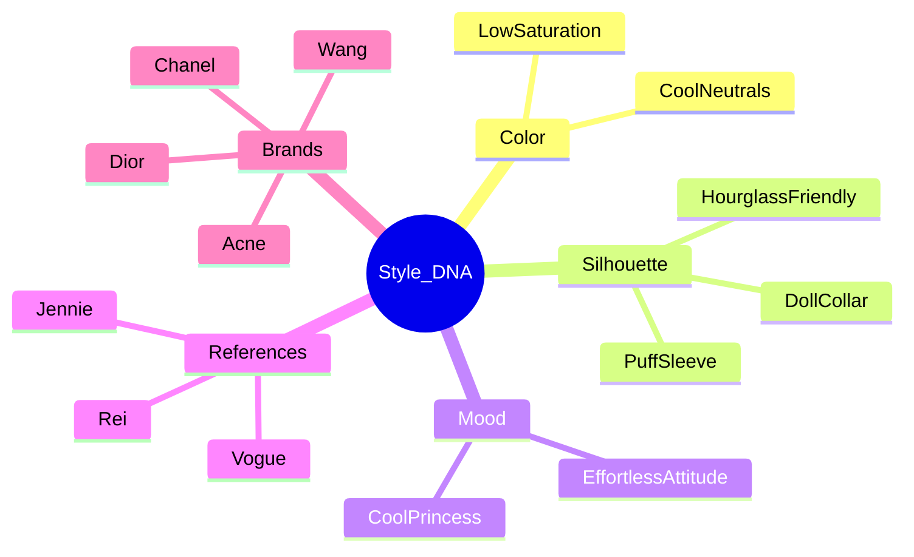
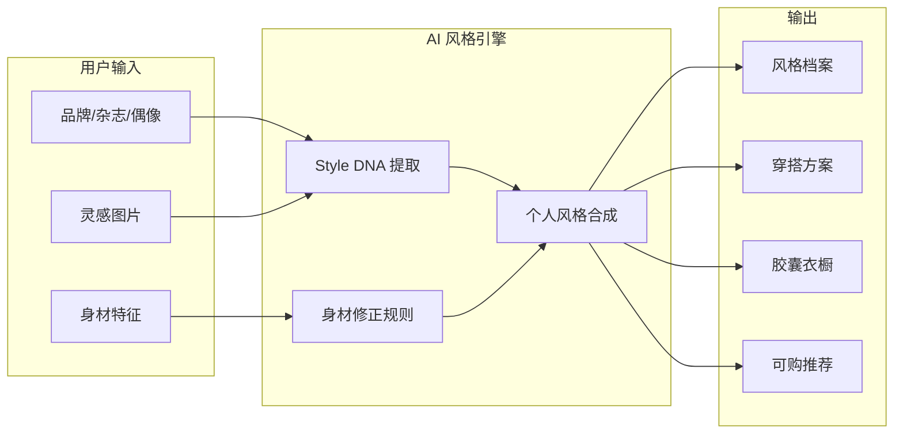
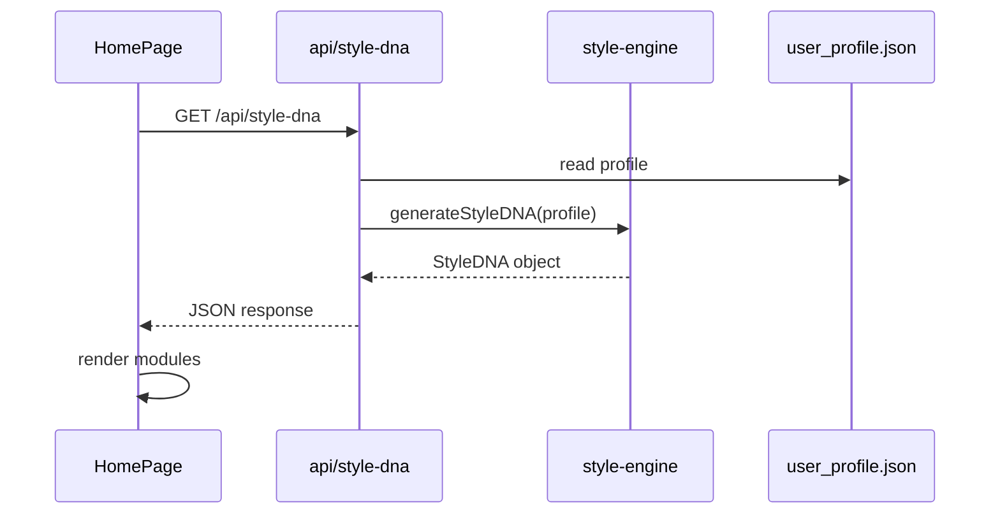

# AI Aesthetic Coach — 用户画像分析与产品方案

## 一、用户 Style DNA（审美基因）总结

基于 [`user_profile.json`](user_profile.json) 提炼出的核心审美基因：

| 维度 | 基因特征 |
|------|----------|
| **色彩** | 冷淡色系为主：黑、白、灰、藏青、低饱和中性色；拒绝高饱和、花哨印花 |
| **廓形** | 沙漏身材友好：收腰、利落线条；偏爱泡泡袖、娃娃领等**结构性女性化细节**，但做减法处理 |
| **质感** | 高级简约：少装饰、重面料与剪裁；接近 Vogue 编辑型审美 |
| **气质** | 「冷淡公主风」—— 不是甜美公主，而是**克制、疏离、有态度的优雅** |
| **发型符号** | 黑长直/黑长卷 + 刘海，作为整体造型的「签名元素」 |
| **场景** | 日常出行，非红毯或派对；追求「随意又有态度」的 off-duty 感 |
| **预算锚点** | 3000–5000 元/件，可触及轻奢与设计师品牌入门线 |
| **文化参照** | Vogue 编辑视角 + K-pop 偶像日常造型（Jennie、直井怜）的街头高级感 |

**一句话 Style DNA：**

> 以冷淡中性色为底色，用结构性女性化细节（泡泡袖、娃娃领）点缀沙漏身形，融合北欧极简（Acne）与法式奢华克制（Chanel/Dior），呈现「不费力的冷淡公主」—— 像 Vogue 内页里走出门的 Jennie。



---

## 二、身材 × 审美的风格方向推断

### 身材要点与穿搭策略

| 身材特征 | 建议方向 | 避免 |
|----------|----------|------|
| 沙漏型 164cm | 强调腰线；合身收腰外套、A 字半裙、裹身针织 | 过度宽松 H 型、无腰线直筒 |
| 脖子短粗 | V 领、方领、深 U 领；露锁骨拉长颈部 | 高领、厚围巾堆叠、复杂领部装饰 |
| 小腿肌肉发达 | midi 裙、阔腿/直筒裤、微喇裤；鞋型简洁利落 | 紧身七分裤、复杂绑带凉鞋强调小腿 |

### 推荐整体风格方向（3 条主轴）

**1. Effortless Cool Princess（主方向）**
- 冷淡公主风的具象化：娃娃领衬衫 + 高腰阔腿裤、泡泡袖针织 + 直筒牛仔
- 参考：Jennie 的 Chanel 日常、直井怜的「可爱但不甜腻」造型
- 关键词：克制、结构感、微女性化

**2. Nordic Minimal Luxe（质感轴）**
- Acne Studio 式廓形与冷灰色调；Alexander Wang 的都市利落
- 大廓形外套 + 修身内搭，用比例对比修饰身形
- 关键词：干净、高级、少即是多

**3. Parisian Off-Duty（场景轴）**
- 日常出行：风衣、软结构西装、乐福鞋/短靴、简约手袋
- Dior 的浪漫感仅作「点缀」（一条丝巾、一枚胸针），不做满饰
- 关键词：随性、编辑感、可穿性

### 色彩与单品优先级

- **主色**：黑、白、燕麦、炭灰、藏青
- **点缀色**：酒红、深棕（手袋/鞋履）
- **优先单品**：V 领针织、娃娃领衬衫、收腰西装、midi 半身裙、阔腿西裤、简约乐福鞋
- **品牌落地（预算内）**：Acne Studio 入门线、COS、Massimo Dutti 高端线作平替；Chanel/Dior 配饰点睛

---

## 三、产品核心功能设计

产品定位：**不是「明星同款生成器」，而是「从参照物中提炼你的个人风格算法」**。



### 核心功能模块

| 功能 | 说明 | 差异化 |
|------|------|--------|
| **Style DNA 档案** | 从问卷 + 图片 + 参照物生成可视化审美基因卡 | 可编辑、可演进，非一次性测试 |
| **灵感解构** | 上传 Pinterest/街拍图，AI 提取「色彩/廓形/气质」而非复制单品 | 强调「学方法，不学同款」 |
| **身材智能修正** | 将风格建议自动叠加身材规则（如 V 领修饰短颈） | 区别于普通穿搭 App 的通用推荐 |
| **参照物映射** | 将 Jennie/Chanel/Vogue 拆解为可迁移原则 | 「像她的态度，不像她的脸」 |
| **每日 Look 生成** | 基于场景（日常出行）、预算、衣橱生成成套方案 | 可保存、可微调 |
| **胶囊衣橱规划** | 20–30 件核心单品清单 + 搭配矩阵 | 长期风格建设，非冲动消费 |
| **品牌匹配器** | 按预算推荐品牌与单品层级（奢品点睛 + 平价骨架） | 连接审美与购买力 |
| **风格演进追踪** | 记录喜好变化，对比 Style DNA 历史版本 | 培养用户粘性 |

### AI 能力分层（实现节奏）

- **MVP（第 1 周）**：规则引擎 + 模板化 Style DNA 展示 + 静态推荐文案
- **V1.1**：接入 LLM（OpenAI/Claude）做灵感图文字分析与 Look 描述生成
- **V1.2**：图像 embedding 做风格相似度与衣橱匹配

---

## 四、首页模块设计

视觉方向：**Vogue 编辑页的大留白 + 衬线标题 + Pinterest 瀑布流灵感墙**。

```
┌─────────────────────────────────────────────────────┐
│  HERO — 全屏编辑感主视觉 + 一句话价值主张              │
│  「找到属于你的风格，而不是复制别人的衣橱」              │
├─────────────────────────────────────────────────────┤
│  Style DNA 快照 — 用户审美基因卡（色彩条/关键词云）     │
├─────────────────────────────────────────────────────┤
│  灵感上传区 — 拖拽上传 + 「解构我的灵感」CTA           │
├─────────────────────────────────────────────────────┤
│  今日 Look — 1–3 套基于档案的推荐穿搭卡片              │
├─────────────────────────────────────────────────────┤
│  灵感瀑布流 — Pinterest 式 masonry 网格（杂志/街拍）   │
├─────────────────────────────────────────────────────┤
│  参照物宇宙 — 品牌 / 杂志 / 偶像 三个 Tab 卡片入口     │
├─────────────────────────────────────────────────────┤
│  身材友好提示 — 针对用户身材的今日一条微建议            │
├─────────────────────────────────────────────────────┤
│  FOOTER — 极简，编辑式排版                           │
└─────────────────────────────────────────────────────┘
```

### 各模块设计要点

| 模块 | 内容 | 视觉参考 |
|------|------|----------|
| **Hero** | 大尺寸 editorial 摄影或渐变 + Playfair/DM Serif 标题 | Vogue.com 首屏 |
| **Style DNA 卡** | 色板、关键词、风格雷达图、一句话描述 | 奢侈品品牌会员档案 |
| **灵感上传** | 虚线拖拽区 + 缩略图预览 | Pinterest 创建 Pin |
| **今日 Look** | 卡片：主图 + 单品列表 + 「为什么适合你」 | Net-a-Porter 编辑精选 |
| **灵感瀑布流** | 不等高网格，hover 显示风格标签 | Pinterest / Vogue Runway |
| **参照物宇宙** | Chanel / Vogue / Jennie 等图标化入口 | 杂志目录页 |
| **身材微建议** | 单行提示条，如「今日试试 V 领针织拉长颈线」 | 轻量、不打扰 |

### 设计系统建议

- **字体**：标题 `Playfair Display` 或 `Cormorant Garamond`；正文 `Inter` 或 `DM Sans`
- **色彩**：米白背景 `#FAF9F7`、墨黑文字 `#1A1A1A`、点缀金 `#C4A77D`
- **组件**：shadcn/ui 的 Card、Dialog、Tabs、Badge；自定义 masonry 网格
- **动效**：缓慢 fade-in、图片 hover scale(1.02)，保持高级克制

---

## 五、MVP 开发计划（第一周）

目标：**可演示的高级感首页 + 用户档案驱动的静态 Style DNA + 基础灵感上传 UI**，暂不依赖真实 AI API。

### 技术栈初始化

```
ai-aesthetic-coach/
├── app/
│   ├── layout.tsx          # 全局字体、米白背景
│   ├── page.tsx            # 首页（各模块组装）
│   ├── profile/page.tsx    # 档案查看/编辑
│   └── api/
│       └── style-dna/route.ts  # 返回基于 profile 的 DNA JSON
├── components/
│   ├── ui/                 # shadcn 组件
│   ├── hero.tsx
│   ├── style-dna-card.tsx
│   ├── inspiration-upload.tsx
│   ├── today-looks.tsx
│   ├── mood-board.tsx
│   └── reference-universe.tsx
├── lib/
│   ├── style-engine.ts     # 规则引擎：profile → DNA + 建议
│   └── types.ts
└── user_profile.json         # 种子数据（可迁移至 DB）
```

### 每日任务拆分

| 天 | 任务 | 交付物 |
|----|------|--------|
| **Day 1** | 项目脚手架：`create-next-app` + Tailwind + shadcn/ui + 字体/色彩 token | 可运行的空白高级模板 |
| **Day 2** | 设计系统 + Hero + Footer；定义 `StyleDNA` / `UserProfile` 类型 | 编辑感首屏 |
| **Day 3** | `style-engine.ts` 规则引擎；`StyleDNACard` 组件；读取 `user_profile.json` | 可展示的审美基因卡 |
| **Day 4** | `InspirationUpload`（前端拖拽 + localStorage 预览）；`TodayLooks` 静态 3 套推荐 | 上传区 + 穿搭卡片 |
| **Day 5** | `MoodBoard` masonry 网格（占位图 + 标签）；`ReferenceUniverse` 三 Tab | Pinterest 风瀑布流 |
| **Day 6** | `profile` 页：表单编辑档案并保存；身材微建议条组件 | 完整用户闭环 |
| **Day 7** | 响应式适配、微动效、整体视觉打磨、README | 可演示 MVP |

### MVP 功能边界（明确不做）

- 真实 LLM / 图像 AI 调用（预留 API route 结构即可）
- 用户注册登录（本地 `user_profile.json` + localStorage）
- 电商跳转与真实库存
- 后端数据库

### MVP 验收标准

- [ ] 首页在桌面/移动端均呈现 Vogue 级留白与排版
- [ ] 加载 [`user_profile.json`](user_profile.json) 后，Style DNA 卡展示色板、关键词、风格描述
- [ ] 可上传灵感图并在首页预览（本地存储）
- [ ] 展示 3 套基于规则的「今日 Look」及「为什么适合你」说明
- [ ] 品牌/杂志/偶像参照入口可点击并展示原则说明（非同款列表）
- [ ] 档案页可编辑并回写 profile

### 第一周后的迭代路线（预览）

- **Week 2**：接入 OpenAI Vision 做灵感图解构；Look 文案 AI 生成
- **Week 3**：胶囊衣橱模块 + 搭配矩阵
- **Week 4**：多用户 auth + 数据库；风格演进历史

---

## 六、关键实现参考（供确认后编码）

**规则引擎核心逻辑示意**（[`lib/style-engine.ts`](lib/style-engine.ts)）：

```typescript
// profile → StyleDNA
// 1. 合并 liked_styles + favorite_brands → 关键词
// 2. 身材规则：短颈 → 推荐 V 领；小腿发达 → 推荐 midi/阔腿
// 3. 生成色板、雷达图维度、今日微建议
```

**首页数据流**：



---

## 确认事项

请确认以下内容后，即可开始生成代码：

1. **界面语言**：默认中文 UI（与 profile 一致）
2. **MVP 数据**：以当前 `user_profile.json` 为种子用户，档案存 localStorage
3. **AI 能力**：第一周用规则引擎 + 精心撰写的静态文案，API 结构预留后续接入
4. **视觉方向**：米白编辑风 + 衬线标题 + Pinterest 瀑布流

如需调整（例如第一版就接入 OpenAI、或改为英文界面），请告知后再进入开发阶段。
